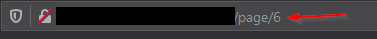
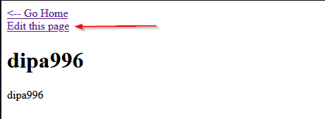
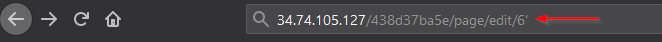
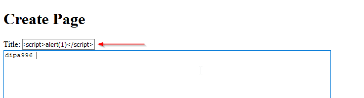
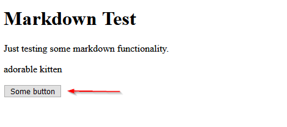
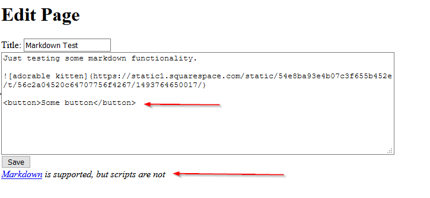
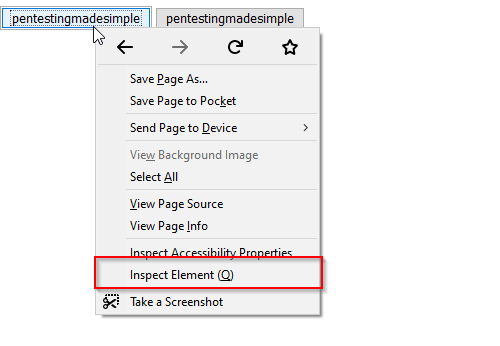

# Micro-CMS v1

## flag0

+ "New page", enumerare cambiando id

+ "Edit page"

Stesso ragionamento e flag trovata.

## flag1

+ testing per SQL injection

## flag2

+ crea nuova pagina e inserisci payload xss nel titolo, poi ritorna su home

## flag3

+ bottone presente in una pagina

+ "Markdown is supported, but scripts are not" , posso creare un payload usufruendo del tag button e dell'event onclick

+ <button onclick=alert(1)>pentestingmadesimple</button>

+ non appare nessuna flags, cercare nel codice sorgente della pagina

