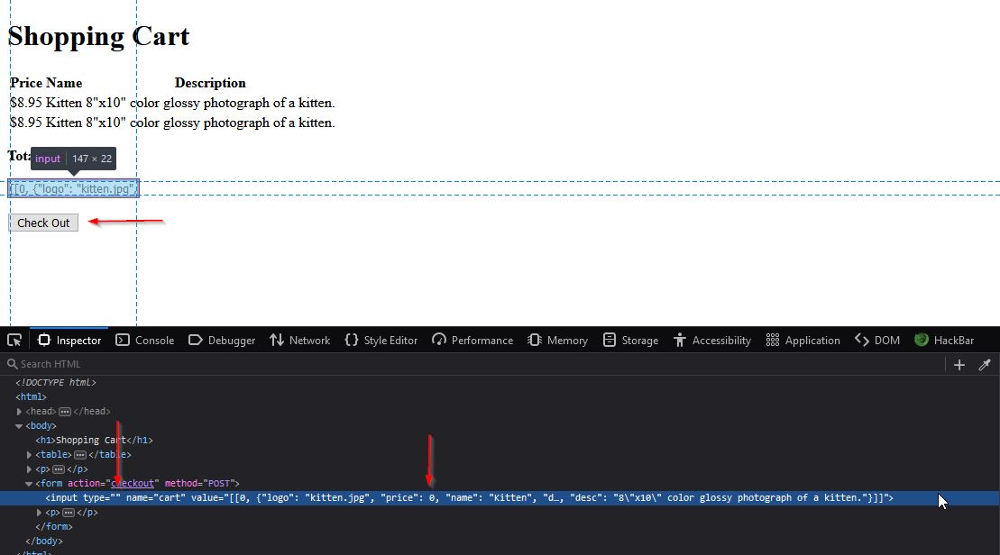
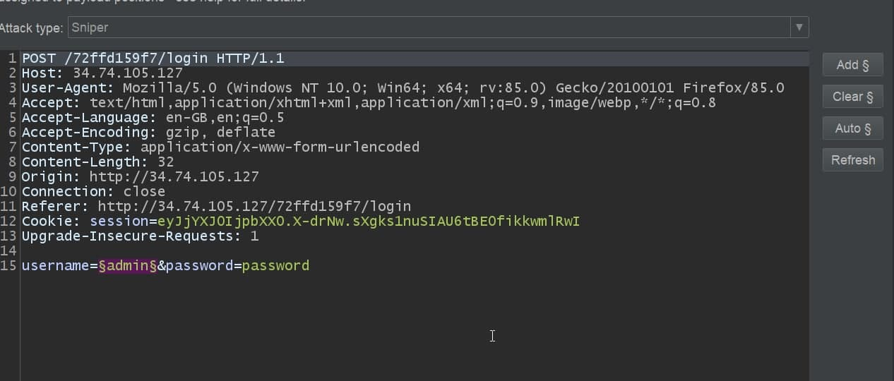
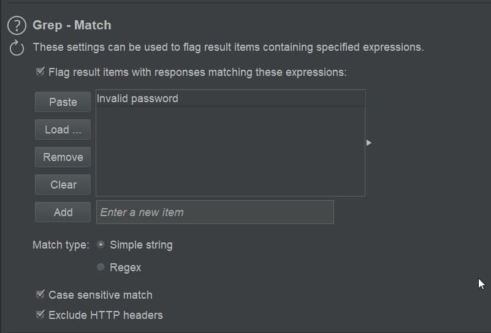
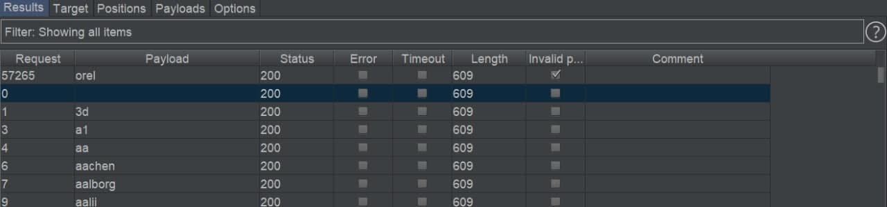
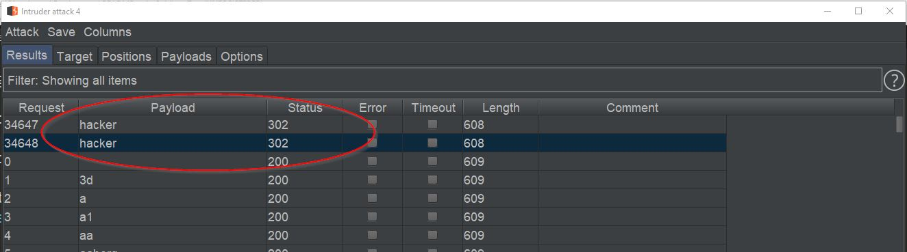
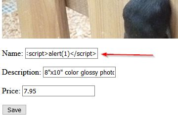

# Petshop Pro

## flag0

+ Hint: It's always nice to get free stuff

+ type="hidden" => type="" esce prompt

+ settare valori del prezzo a 0 o 0.0 e procedere al checkout.

## flag1

+ Hint: There must be a way to administer the app && Tools are also great for finding credentials

+ pagina di login su /login

+ [username] admin [password] admin => Invalid username 

+ bruteforce con burpsuite intruder o hydra ( io con burpsuite con questi settaggi )

+ burpsuite intruder

+ options di intruder 

+ risultato aspettato ( username e password sono sempre diversi)

+ ripetere stesso procedimento per la password ma togliere grep a "Invalid password" e guardare per status code 302 (redirect a login avvenuto con successo)

+ bagno di umiltà

+ Io ho usato questa wordlist sia per username che per password, non è la prima volta che questa wordlist si rivela utile.
+ [wordlist username](https://github.com/jeanphorn/wordlist/blob/master/usernames.txt)

## flag2

+ Hint: Always test every input

+ Unici parametri sono quelli su edit, SQLi non funziona e si va di classico xss

`<script>alert(1)</script`

+ procedere al checkout e flag dump