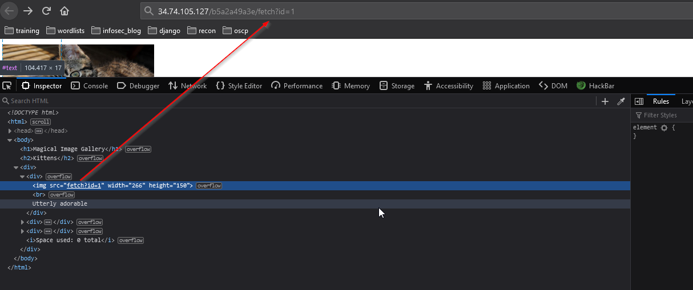
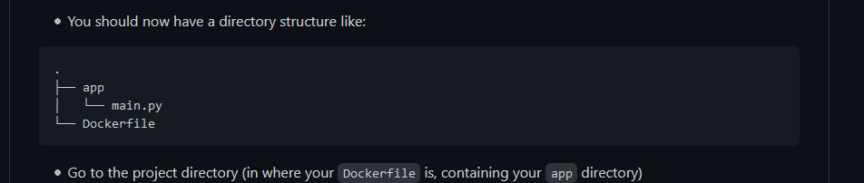
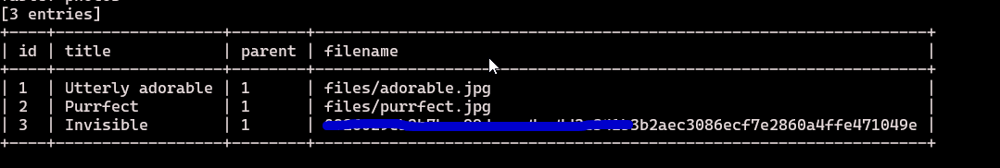
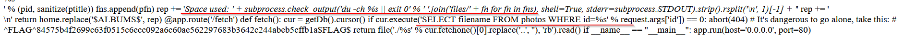

## Photo gallery

# flag0

+ Hint: Consider how you might build this system yourself. What would the query for fetch look like?

+ `/fetch?id=1 OR 1=1 --` non manda in errore l'esecuzione della query

+ Hint: This application runs on the [uwsgi-nginx-flask-docker image](https://github.com/tiangolo/uwsgi-nginx-flask-docker)

+ 

+ Hint : Take a few minutes to consider the state of the union

+ `/fetch?id=22 UNION select 'main.py'--` , come da immagine è possibile leggere anche Dockerfile

# flag1

+ [sqlmap](https://github.com/sqlmapproject/sqlmap)

# flag2

+ Hint : That method of finding the size of an album seems suspicious

+ in 'main.py' `SELECT filename FROM photos WHERE id=%s'` && ` 'Space used: ' + subprocess.check_output('du -ch %s || exit 0'` 

+ Hint : Stacked queries rarely work. But when they do, make absolutely sure that you're committed

+ [commit sql](https://stackoverflow.com/questions/16259428/mysql-command-line-and-transactions)

+ work in progress...